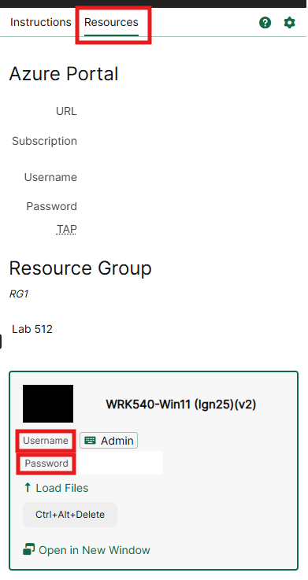
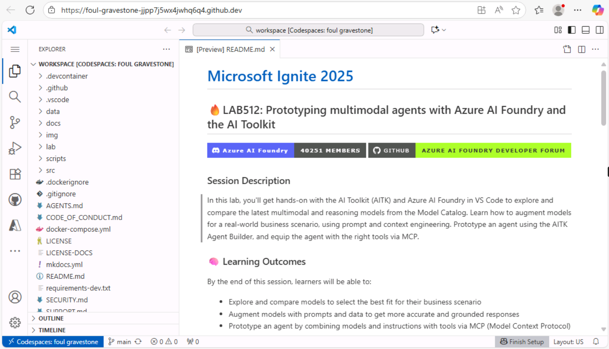
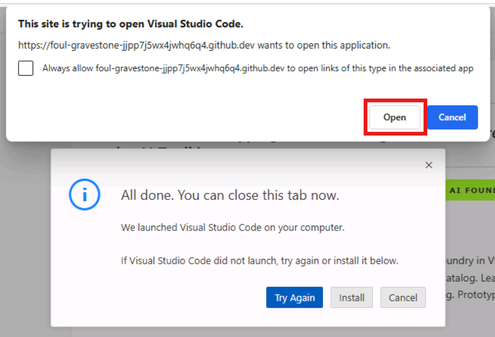
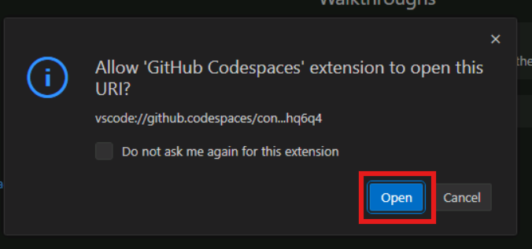
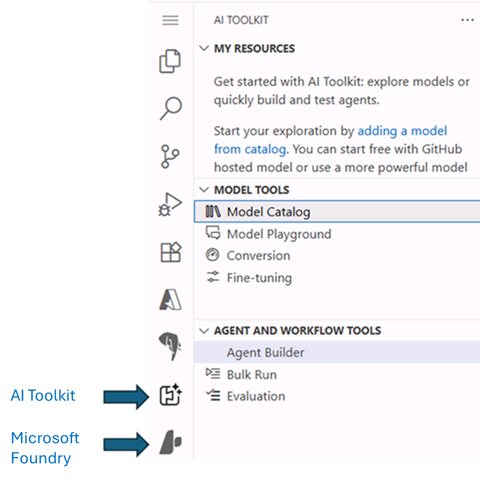

# Get started

> [!TIP]
> What is the **AI Toolkit(AITK)**? [The AI Toolkit (AITK)](https://code.visualstudio.com/docs/intelligentapps/overview) is an extension for Visual Studio Code that provides a unified interface to access and interact with various AI models and services. It allows users to easily explore, compare, and utilize different AI models from multiple providers, both proprietary and open source, hosted on several platforms, such as Github, Microsoft Foundry or even locally. With AITK, developers can streamline their Generative AI development workflow by integrating model selection, prompt engineering, and agent prototyping and testing directly within their code editor.

## Sign in to Windows

As a first step, login into the lab Virtual Machine using the credentials you can find in the **Resources tab** under the Skillable VM name.

> [!TIP]
>  First time using **Skillable?** The green "T" (e.g., +++Admin+++) indicates values that are automatically input for you at the current cursor location in VM, with one click. This reduces your effort and minimizes input errors.
> Also, you can always click on the images to enlarge them, if needed.

## Open workshop in a GitHub Codespace

In this workshop, we will be using **GitHub Codespaces** to launch a cloud-hosted development environment with all the necessary tools and dependencies pre-installed. This will allow you to focus on learning and prototyping without worrying about local setup.

To launch a codespace you need a **GitHub account**. Follow the instructions below to sign-in with a given GitHub Enterprise (GHE) account and create a GitHub Codespace for this lab.

1. Open the edge browser from the taskbar. You'll get a browser tab with the GHE sign-in page already opened for you.

2. Sign-in with the following credentials:
   -  Username: +++@lab.CloudPortalCredential(User1).Username+++
   -  TAP: +++@lab.CloudPortalCredential(User1).TAP+++

3. Once you are signed in, you'll be redirected to the [GitHub repo](https://github.com/skillable-events/ignite25-LAB512-prototyping-multimodal-agents-with-azure-ai-foundry-and-the-ai-toolkit) hosting the lab code and resources.

4. Next, click on the green **Code** button and select **Create codespace on main** from the **Codespaces** tab.

    

> [!WARNING]
> The codespace creation process might take a few minutes, as all the necessary dependencies and tools are being set up in the cloud environment.

5. Once the codespace is created, you'll see a Visual Studio Code environment loaded in your browser.

6. You might choose to continue working in the browser or click on the **Open in VS Code** button to open it in the desktop application (recommended option).

    

7. If you choose to open it in the desktop application, you'll be prompted to confirm opening the VS Code Desktop app. Click **Open** to proceed.

> [!NOTE]
> You'll also get a popup *"All done. You can close this tab now."* in the browser, that you can just ignore.

8. Once VS Code Desktop is opened, you'll be asked to allow access to the codespace. Click **Open** to proceed.

9. Next, you'll be asked to sign in to GitHub from VS Code. By clicking **Allow**, a browser window will open to complete the sign-in process. Click **Continue** to proceed with the GitHub Enterprise account you used to create the Codespace. And then click on **Authorize Visual Studio Code** to complete the sign-in process. Also, when asked to allow VS Code access to public and private networks, click **Allow**.

10. Once the sign-in process is completed, the site will try to redirect you back to VS Code. Click on the **Open** button to proceed.

11. Back in VS Code, you are now set to start working in the codespace environment. You should see a layout pretty similar to what you had in the browser.

## Login to Azure

In the GitHub Codespace, you should be able to see two Visual Studio Code extensions already installed: 
- The **AI Toolkit**: this is the extension we will be using to interact with various AI models and services in this lab.
- The **Foundry** extension: it's installed as a bundle of the AI Toolkit and provides access to Microsoft Foundry hosted models. 
If they are correctly installed, you should see their icons in the left sidebar of VS Code, as per screenshot below.

> [!TIP]
> If you don't see the icons, click on the ellipsis (...) at the bottom of the sidebar to see the full list of installed extensions. If you still don't see them, and you are still in the browser-based experience, try refreshing the page or re-opening the codespace in VS Code Desktop app.

> [!WARNING]
> The VS code extensions have been pinned to specific versions within the GitHub Codespaces environment to ensure consistency with the lab manual instructions and avoid unexpected issues. Please refrain from updating these extensions during the lab.

> [!WARNING]
> The VS code extensions have been pinned to specific versions within the GitHub Codespaces environment to ensure consistency with the lab manual instructions and avoid unexpected issues. Please refrain from updating these extensions during the lab.

Now click on the Foundry extension icon, and then click on **Set Default Project** -> **Sign in to Azure**.

You'll be prompted with a popup to confirm with the Azure login. Click **Allow**.

Next, you'll be redirected to a browser window to complete the login process. Enter the following credentials:
-  Email: +++@lab.CloudPortalCredential(User1).Username+++
-  TAP: +++@lab.CloudPortalCredential(User1).TAP+++

> [!NOTE]
> You'll be asked to confirm if you want to allow the automatic sign-in to all desktop apps and websites on the device. Click **Yes, all apps** to proceed. Then click **Done** to complete the login process and return to VS Code.

Back in your codespace or your VS Code instance, you'll be asked to select the Foundry project to use. Select the only available option, which is the project pre-deployed for this workshop.

## Got issues when logging in with GitHub?

> [!NOTE]
> If you are properly logged in with the GHE account as per previous step, please ignore this section and move to the next one.

If you encounter issues when logging in with the given GHE account, you can always use your own, by following the steps below:

1. Navigate to the [GitHub repo](https://aka.ms/msignite25-lab512) hosting the lab code and resources. 

    > [!TIP]
    > Click the Star button in the top right corner, this will help you easily find it later.

2. To launch a codespace, you need a **GitHub account**. 

    > [!NOTE]
    > If you already have a GitHub account, you can move to step 3 directly.

    To create one, click on the **Sign up** button and follow the instructions below:
    - In the new window, enter a personal email address, create a password, and choose a username.
    - Select your Country/Region and agree to the terms of service.
    - Click on the **Create account** button and wait for the verification email to arrive in your inbox.

    

    - Copy the verification code from the email and paste it into the verification field on the GitHub website. Then click on **Continue**.
    - Once the account is created, you'll be redirected back to the GitHub repo page and you'll see a green banner at the top, like the one in the screenshot below.

    

> [!WARNING]
> If your personal GitHub account is a free-tier one, you will have some limitations in the range of GitHub-hosted models you can access in the AI Toolkit Model Catalog. For example, you won't be able to use the GPT-5 family of models. You can still proceed with the lab using available models (recommended: OpenAI gpt-4.1).

3. Click on **Sign in** and enter your GitHub credentials to log in. If you just created your account, use the username and password you set during the sign-up process.

## Ready to start

That covers the necessary setup to work with the AI Toolkit in VScode and Microsoft Foundry hosted models. We will now move forward to begin exploring the Model Catalog and interacting with the models.
Click **Next** to proceed to the following section of the lab.