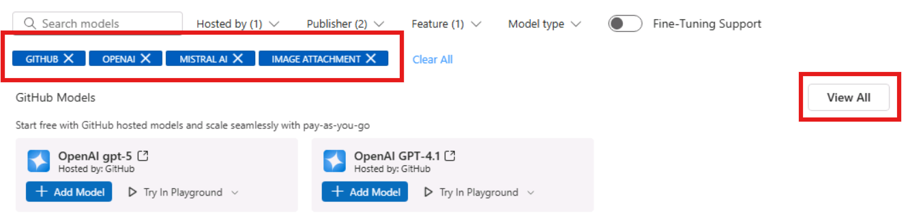
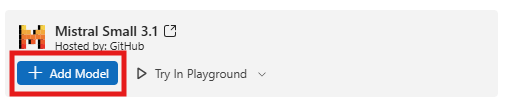
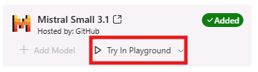
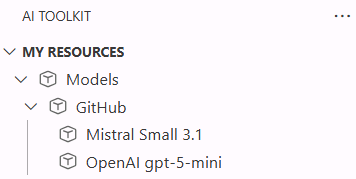
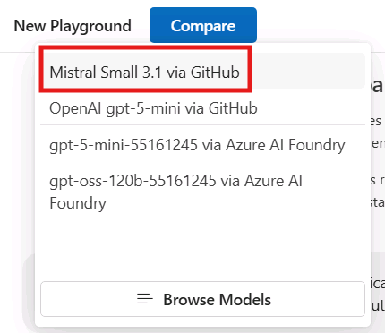
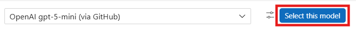
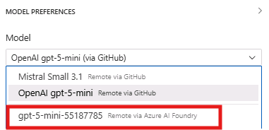

# Model Selection: Exploring the AI Toolkit Model Catalog

In this section, you will explore the AI Toolkit Model Catalog to discover, filter, and compare models for your multimodal agent project. The Model Catalog provides access to models from various providers including GitHub, Azure AI Foundry, OpenAI, and others.

## Step 1: Apply Filters to Narrow Your Selection

1. In your codespace, locate the **AI Toolkit** extension icon in the left sidebar
2. Click on the AI Toolkit icon to open the extension panel
3. Click on **Model Catalog** to browse available models


On the top of the page you'll find the most popular models; scroll down to see the full list of available models.

Since the list is quite consistent, you can use the filtering options to narrow down the selection based on your requirements.

Before proceeding, close the GitHub Copilot Chat panel that has been loaded on the right side of your codespace, by clicking on the 'X' icon in the top right corner of the panel. Also, click on the 'AI Toolkit' app icon to temporarily hide it, so you have more space to work with the Model Catalog.


By doing so, you'll see the filtering options - previously regrouped under **All filters** - displayed individually at the top of the Model Catalog panel.


### Filter by Hosting Provider

1. Click on the **Hosted by** filter dropdown. You have several options, such as GitHub, Azure AI Foundry, OpenAI and you can even leverage models hosted on your local infrastructure, through Ollama or ONNX.

2. Select **GitHub** to view free-to-use models that are excellent for prototyping.

> [!NOTE]
> GitHub models are perfect for getting started because they're free to use, but they are token-rate limited. You can experiment without cost concerns, but for production deployments consider using a pay-as-you-go offering through your GitHub Account or Azure AI Foundry.

### Filter by Publisher

1. Click on the **Publisher** filter dropdown to filter by the model publisher, such as Microsoft, Meta, Cohere, etc. Note that you can find both open-source and proprietary models.
2. Select **OpenAI** and **Mistral AI** to view models from these two leading providers.

### Filter by Model Features

1. Click on the **Features** filter dropdown to filter by model capabilities, such as image/audio or video processing, tool calling, etc.
2. Select **Image Attachment** to find multimodal models that support visual input processing and enables multimodal interactions combining text and images.

## Step 2: Add Models to Your Collection

After applying filters, you'll see a refined list of models. 

For this exercise:

1. Locate the **OpenAI GPT-5-mini** and **Mistral Small 3.1** models in the filtered results.
   - **OpenAI GPT-5-mini** is a full-featured multimodal model with comprehensive capabilities
   - **Mistral Small 3.1** is an optimized smaller model with faster response times and lower costs.
   
> [!TIP]
> If you cannot see one of the two models, click on **View All** to see the complete list of filtered models.
>
> 

2. Click **Add model** on each model tile to add them to your collection.



> [!NOTE]
> Once they are added, the blue button will change to green with the label **Added**.

## Step 3: Open the Playground for Testing

1. Click on **Try in Playground** within the model tile. The Playground allows you to test and compare models interactively.



2. You'll be prompted to login to your GitHub account to access the free-tier models. Click **Allow** and complete the authentication process, by using the same GitHub credentials you used in the [previous lab section](./01_Get_Started.md).

> [!TIP]
> Now that you are logged in, you should be able to see the models you added into your collection in the 'My resources' tab, under 'GitHub'.
>
> 
>
> If you don't see them, it's likely because the view hasn't refreshed yet. Proceed to the next step, and the models should appear in the Playground.

3. In the **Model** field, you'll see the name of the model you just selected, for example **Mistral Small 3.1 (via GitHub)**. 


> [!WARNING]
> You might experience some delay in model loading, especially if it's your first time accessing the Playground. Please be patient while the model initializes.

4. Next, click the **Compare** button to enable side-by-side comparison
5. From the dropdown, select your second model (GPT-5-mini if Mistral Small 3.1 is already selected)
6. You now have two models ready for comparison testing



## Step 4: Test Text Generation and Multimodal Capabilities

> [!TIP]
> The side-by-side comparison allows you to see exactly how different models handle the same input, making it easier to choose the best fit for your specific use case.

Let's start interacting with the models with a simple prompt:

1. Enter this prompt in the text field (where you see the placeholder "Type a prompt"):
   ```
   What materials are commonly used for building a wooden deck?
   ```
2. Click the paper airplane icon to execute the prompt on both models simultaneously


> [!WARNING]
> Since you are testing a free-tier GitHub-hosted model experience, you might encounter some latency in model response times, especially for more complex prompts.

Now let's test their reasoning capabilities, with the following prompt:
```
I am planning to install outdoor deck lighting for my new 12x16 foot deck. I want to place lights every 4 feet along the perimeter for even illumination. However, I discover that one corner of my deck will be shaded by a large tree, making that area naturally darker. Given these constraints, how should I adjust my lighting layout to ensure uniform brightness across the entire deck? Consider the principles of light distribution and explain your reasoning step by step.
```

Next, test the models' image processing capabilities:

1. Enter this prompt in the text field:
   ```
   Describe what's in the image, including colors of the objects.
   ```

2. Click the image attachment icon to add a picture as input


3. Select an image file to upload. You'll be prompted with a text field with a default file path in your workspace directory. Replace it with the following:
   ```
   /workspace/img/demo-living-room.png
   ```


4. Send the multimodal prompt on both models simultaneously.


## Step 5: Analyze and Compare Results

Review the outputs from both models, using several factors to guide your evaluation:

- **Response Quality**: Compare the depth and accuracy of descriptions, as well as the coherence with the input prompt.
- **Detail Level**: Which model provides more comprehensive analysis?
- **Processing Time**: Note any differences in response speed.
- **Output Formatting**: Evaluate clarity and organization of responses, as well as verbosity.
- **Token Usage**: Inspect the token usage for each model to understand cost implications. Note that token usage may vary not only based on the verbosity of the response but also on the tokenizer efficiency of each model.

> [!TIP]
> Number of output tokens is visible in the response footer, along with characters length. LLMs are non-deterministic, so you might see slight variations in token usage across multiple runs with the same input prompt.


## Step 6: Import selected model from Azure AI Foundry

Once we are done with the comparison, we are going to select one of the two models for further prototyping in the next lab sections. For the sake of this exercise, let's go with **GPT-5-mini**. 

> [!TIP]
> To come back to the standard Playground (with a single pane and a single model),you can click on **Select this model** on the right side of the model name.
>
> 

Now, since in the next section we are going to augment the model with additional context data relative to Zava, our DIY retail company, we need to switch to a model hosted in Azure AI Foundry, which provides enterprise-grade security and compliance features.

Go back to **Model Playground** and expand the **Model** dropdown and select the gpt-5-mini instance hosted in Azure AI Foundry, that has been pre-deployed for this workshop, in the project you logged into in the [previous lab section](./01_Get_Started.md).



> [!NOTE]
> While GitHub models are excellent for prototyping, Azure AI Foundry hosted models provide the enterprise features needed for production deployments, including enterprise-grade security and compliance, Service Level Agreements (SLAs), enhanced performance and scalability, and integration with other Azure services.

## Key Takeaways

- The Model Catalog provides a comprehensive view of available AI models from multiple providers
- Filtering capabilities help you quickly identify models that match your specific requirements
- Model comparison in the Playground enables data-driven decision making
- Different hosting options offer varying benefits for different stages of development
- Multimodal capabilities can be tested effectively using the built-in comparison tools

This exploration process ensures you select the most appropriate model for your specific use case, balancing factors like performance, cost, features, and deployment requirements.
Click **Next** to proceed to the following section of the lab.