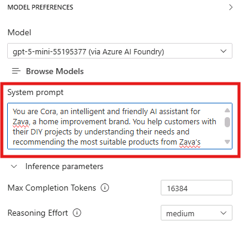

# Model Augmentation: Enhancing Context for Improved Performance

In this section, you will learn how to augment your selected model using prompt engineering and context data to improve its performance and relevance to your specific use case. This is a crucial step in tailoring AI models to meet the unique needs of your business scenario.

## Step 1: Crafting the System Message

The system message is a critical component of the prompt that sets the behavior and context for the AI model. It helps the model understand its role and the specific requirements of the task at hand. Here are some key considerations for crafting an effective system message:

1. **Be Clear and Concise**: Clearly articulate the purpose of the interaction and the desired outcome. Avoid ambiguity to ensure the model understands the task.

2. **Provide Context**: Include relevant background information or context that will help the model generate more accurate and context-aware responses.

3. **Set Expectations**: Specify any constraints or requirements for the response, such as format, length, or style.

4. **Break Down Complex Instructions**: If the task is complex, consider breaking it down into simpler, step-by-step instructions to guide the model effectively.

In the **System Prompt** field of the Playground, in the right pane, enter the following system message:

```
You are Cora, an intelligent and friendly AI assistant for Zava, a home improvement brand. You help customers with their DIY projects.

Your role is to:
- Engage with the customer in natural conversation to understand their DIY goals.
- Ask thoughtful questions to gather relevant project details.
- Be brief in your responses.
Your personality is:
- Warm and welcoming, like a helpful store associate
- Professional and knowledgeable, like a seasoned DIY expert
- Curious and conversational—never assume, always clarify

Stick to the Zava business and DIY topics. If the customer asks something outside of that, politely let them know you can only assist with Zava-related inquiries.
```


Note that this message includes:
- A clear definition of the assistant's **role and responsibilities** ("You are Cora, an intelligent and friendly AI assistant for Zava...")
- Specific instructions on **how to interact with customers** and what to focus on (e.g., "Engage with the customer in natural conversation...")
- Guidelines on **tone and style** to ensure consistent and appropriate responses (e.g., "Warm and welcoming, like a helpful store associate...")
- Safety **guardrails** to keep the assistant focused on relevant topics ("Stick to the Zava business and DIY topics...")

## Step 2: Testing the System Message with Multimodal Input

Now that we configured the system prompt, let's test the system with a multimodal user prompt. Attach again the same image - 'demo-living-room' - of the living room we used in the previous section, available at the following path:

```
/workspace/img/demo-living-room.png
```
Combine it with the following user prompt:

```
Here’s a photo of my living room. I’m not sure whether I should go with eggshell or semi-gloss. Can you tell which would work better based on the lighting and layout?
```

The model will analyze the image and provides a suggestion, adding some reasoning to back up its recommendation. Read through the response and see if it aligns with the expectations set in the system message.

Let's now test the model with a user query which is not relevant to Zava's business. Enter the following prompt:

```
What’s the weather like in San Francisco today? 
```

The model should politely inform the user that it can only assist with Zava-related inquiries, demonstrating its ability to follow the guidelines set in the system message.

## Step 3: Adding Grounding Data

In addition to the system message, providing context data can significantly enhance the model's ability to generate relevant and accurate responses. Context data can include information about your business, products, services, or any other relevant details that can help the model better understand the scenario.

For our use case, we are going to provide the model with some context about Zava's product catalog, as we'd like our solution to be able to recommend products based on customer queries. In fact, the model doesn't have any knowledge besides its training data, so it doesn't know anything about Zava's products and could make up information if asked about them.

To add grounding data, we will use the **file attachment** feature in the Playground. This allows us to upload documents that the model can reference when generating responses.

The document we are going to upload is a JSON file containing the Zava's product catalog, with a selection of DYI-related products - including paints, hammers, pliers and several other tools - along with all their details - description, availability, price. In the workspace directory, browse to the `/workspace/data/` folder and locate the file named `zava_product_catalog.json`. [Open it](../../data/zava_products_catalog.json) in the code editor to take a look at its content.

1. Click the file attachment icon in the prompt input area.

2. Select the file `zava_product_catalog.json` from the `/workspace/data/` directory.

> [!TIP]
> In the text field that appears, you can enter the following path to the file:
> ```
>/workspace/data/zava_product_catalog.json
> ```


3. Once the file is uploaded, it will appear as an attachment below the prompt input area.
4. Enter the following prompt in the text field:
```
Suggest an eggshell paint from the attached Zava product catalog.
```

The model will analyze the uploaded product catalog and provide a grounded suggestion for an eggshell paint that matches the user's request.

What happens behind the scenes is that the attached data are automatically included in the prompt context, enabling the model to generate more informed and relevant responses.

Of course this approach has its limitations, as the model can only process a limited amount of text in the prompt context, and the larger is the attached context the higher is the response latency and cost. For larger datasets or more complex scenarios, you need to implement a more sophisticated retrieval mechanism to ensure the model prompt includes only the most relevant information for the current user query. We are going to explore this in more detail in the next section of this workshop.

## Key Takeaways
- Crafting an effective system message is crucial for guiding the model's behavior and ensuring relevant responses.
- Providing context data through file attachments can significantly enhance the model's performance and relevance.
- Testing the model with multimodal input helps validate the effectiveness of the system message and context data.
- Grounding data should be relevant and concise to fit within the model's input limitations.        

Click **Next** to proceed to the following section of the lab.