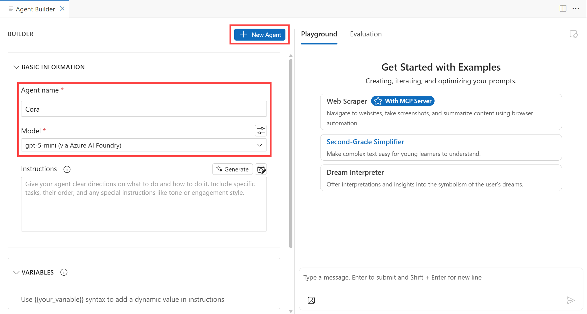
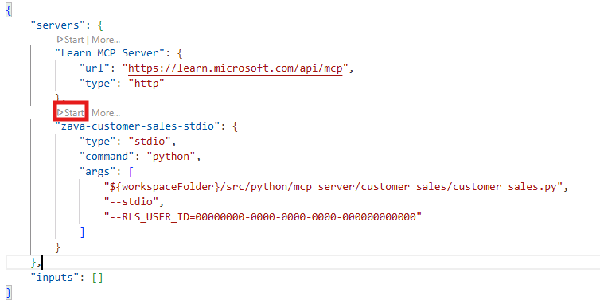
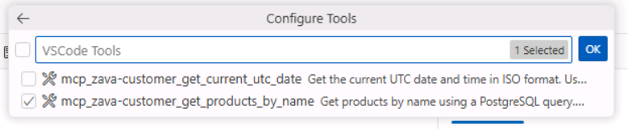

# Agent Building: Building the Zava Agent with Agent Builder

In this section, you will learn how to create the Cora agent with Agent Builder in the AI Toolkit and equip it with tools, allowing the agent to take actions on behalf of the user. Agent Builder streamlines the engineering workflow for building agents, including prompt engineering and integration with tools, such as MCP servers.

## Step 1: Explore Agent Builder

To access Agent Builder, in the AI Toolkit view, select **Agent Builder**.


Agent Builder's UI is organized into two sections. The left side of Agent Builder enables you to define the basic information for the agent such as its name, model choice, instructions, and any relevant tools. The right side of Agent Builder is where you can both chat with the agent and evaluate the agent's responses.

> [!NOTE]
> The **Evaluation** features are only available once you've defined a variable within your agent's **Instructions**. Evaluations are further explored in the **Bonus** section of this lab.
>

## Step 2: Create the Agent

Let's create Zava's Cora agent! In **Agent Builder** select **+ New Agent**. Within the **Agent name** field, enter **Cora**. For the agent's **Model**, select the **gpt-5-mini (via Azure AI Foundry)** model.



## Step 3: Provide Instructions for the Agent

Similarly to what we've previously done in the Model Playground, we'll now need to define the behavior of the agent, through the system prompt. 

> [!TIP]
> The Agent Builder provides a **Generate** feature that uses a large language model (LLM) to generate a set of instructions from a description of your agent's task. 
> This feature is helpful if you need guidance in crafting the agent's instructions.
> 

For the sake of this lab, we'll leverage a set of instructions similar to the one we used in the [previous section](./03_Model_Augmentation.md):

```
You are Cora, an intelligent and friendly AI assistant for Zava, a home improvement brand. You help customers with their DIY projects by understanding their needs and recommending the most suitable products from Zava’s catalog.​

Your role is to:​

- Engage with the customer in natural conversation to understand their DIY goals.​

- Ask thoughtful questions to gather relevant project details.​

- Be brief in your responses.​

- Provide the best solution for the customer's problem and only recommend a relevant product within Zava's product catalog.​

- Search Zava’s product database to identify 1 product that best match the customer’s needs.​

- Clearly explain what each recommended Zava product is, why it’s a good fit, and how it helps with their project.​
​
Your personality is:​

- Warm and welcoming, like a helpful store associate​

- Professional and knowledgeable, like a seasoned DIY expert​

- Curious and conversational—never assume, always clarify​

- Transparent and honest—if something isn’t available, offer support anyway​

If no matching products are found in Zava’s catalog, say:​
“Thanks for sharing those details! I’ve searched our catalog, but it looks like we don’t currently have a product that fits your exact needs. If you'd like, I can suggest some alternatives or help you adjust your project requirements to see if something similar might work.”​
```

Note how we added some additional details on Cora's task of searching Zava product catalog to recommend the best fit for the customer's request ("Search Zava’s product database to identify 1 product that best match the customer’s needs.").
However, we didn't provide Cora with the access to the product catalog yet. Let's do it in the upcoming step.

## Step 4: Start the MCP server

> [!NOTE]
 > [Model Context Protocol (MCP)](https://modelcontextprotocol.io/docs/getting-started/intro) is a powerful, standardized framework that optimizes communication between Large Language Models (LLMs) and external tools, applications, and data sources.

Earlier in the **Model Augmentation** exercise, we added grounding data to the model in the form of a `zava_product_catalog.json` file attachment. While that may have been convenient for the sake of testing the base model prior to model selection, what we'd recommend is to ground the agent with data in such a way that's scalable and adaptable to Zava's changing inventory. 

To address that, we'll leverage the Zava **Basic Customer Sales** MCP server, which has been configured to run locally in this codespace. This server consists of a **get_products_by_name** tool which enables Cora to do product searches by name with fuzzy matching, get store-specific product availability through row level security, and get real-time inventory levels and stock information. The retrieval of relevant information is handled automatically by the MCP server, which communicates with the agent via the MCP standard, so that the agent can focus on generating responses based on the most relevant and current data.

To start the **Basic Customer Sales** server, within your Visual Studio Code workspace, go to **Explorer** from the side bar menu, navigate to `.vscode/mcp.json`. Within the `mcp.json` file, locate the `zava-customer-sales-stdio` server and click **Start** above the server.



> [!TIP]
> Once the server is started, you should see the status change to **Running**.

## Step 5: Add a Tool to the Agent

The **Basic Customer Sales** server consists of two tools:
- get_products_by_name
- get_current_utc_date

For this lab, we'll only use the **get_products_by_name** tool. Ideally, you'll only want to give your agent access to tools that are relevant for its purpose.

Back in Agent Builder, select the **+** icon next to **Tools** to open the wizard for adding tools to the agent. 


Then select the **MCP Server** option. When prompted, select **Use Tools Added in Visual Studio Code**. In  the list of tools available, only select the **mcp_zava_customer_get_products_by_name** tool and click **OK**. You can unselect all tools by unchecking the box at the top of the wizard next to the search bar.



## Step 6: Chat with the Agent

You're now ready to test whether the Cora agent executes a tool call when given a prompt that warrants leveraging a tool! On the **Playground** tab, attach the 'demo-living-room.png' and submit the following prompt:

```
Here’s a photo of my living room. Based on the lighting and layout, recommend a Zava eggshell paint.
```

If the agent wants to call a tool, a notification will appear in Visual Studio Code requesting to **Run get_products_by_name**. Select **Yes** to execute the tool call.


Assuming the agent executes a tool call, a section appears in the agent output indicating which tool was invoked.


Due to the non-deterministic nature of language models, the agent's output will differ each time the aforementioned prompt is submitted. Provided below is example of the agent's response:

> For your lovely interior, I recommend our Interior Eggshell Paint from Zava's Paint & Finishes collection.  
>  
> **Why It's a Good Fit:**  
>  
> - **Finish:** Eggshell finish provides a smooth, subtle sheen that's more durable and washable than matte paints, making it ideal for living spaces with moderate traffic.  
> - **Versatility:** Works well on various surfaces, including walls and woodwork, complementing both modern and traditional interiors.  
> - **Aesthetic:** Its light-reflecting quality adds brightness, perfect for enhancing natural light in your room.  
>  
> **Product Details:**  
>  
> - **Category**: Paint & Finishes  
> - **Price**: $65.67  
> - **Stock**: Available  
>  
> This paint will help to bring a soft, sophisticated look to your space while being easy to care for. If you have any other questions or need more details, feel free to ask!

If the Cora agent did not recommend an eggshell paint from the product catalog, there's various techniques that we could leverage to modify the agent's behavior to encourage the use of the **get_products_by_name** tool. One should way would be to modify the **Instructions** to explicitly reference the required tools to use in which the model has access.

If you'd like to continue testing tool calls with the Cora agent, try submitting the following prompts in the Playground:

- How much is Zava's eggshell paint?
- What are the current inventory levels for Zava's eggshell paint?

## Key Takeaways

- Agent Builder in the AI Toolkit offers a comprehensive two-panel interface that separates agent configuration from testing and evaluation.
- Crafting specific instructions shapes the agent's personality, conversational style, and response patterns for consistent interactions.
- Model Context Protocol (MCP) servers offer a standardized framework for connecting AI agents to external tools and data sources more effectively than static file attachments.
- Integrating MCP tools allows agents to retrieve current inventory levels, pricing, and product information dynamically rather than relying on outdated static data.

Click **Next** to proceed to the following section of the lab.