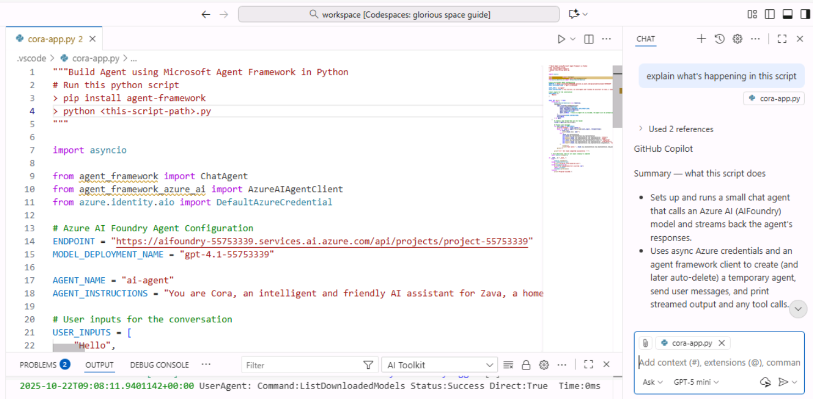
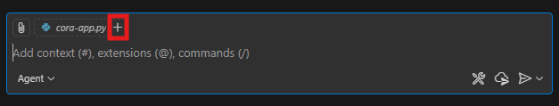

# Migrate to Code

In this section, you will learn how to migrate the agent you've created in AI Toolkit to a code-based workflow.

The AI Toolkit provides generated code for agents created in Agent Builder. You can choose your preferred SDK as well as programming language. Once you have your code file, you can integrate your agent into your own app.

## Step 1: Generate the Code

In Agent Builder, scroll down towards the bottom of the left side of the screen and select **View Code**.


When prompted, select your preferred client SDK (e.g. *Microsoft Agent Framework*) and programming language (e.g. *Python*). Once the new file is created, save the file to your workspace.

## Step 2: View the Code

Before running the script, review the content of the file as there may be placeholders that must be modified before running. If you need assistance understanding the script logic, you could leverage GitHub Copilot Chat in **Ask** mode.

To access GitHub Copilot Chat, select the **Toggle Chat** icon at the top of the Visual Studio Code window.


Then click on **Finish Setup** -> **Set up Copilot** at the bottom right corner of the chat window.


> [!NOTE]
> If asked to log in, select **Sign-in** -> **Continue with GitHub**. Then click on **Continue** to proceed with the GitHub Enterprise account you used to access the GitHub hosted models, when redirected to the GitHub sign-in page.

Save the generated code file to your workspace as 'src/python/cora-app.py'. Be sure to have the file active so that GitHub Copilot Chat can use the file as context. Alternatively, you could reference the specific file itself in your prompt to GitHub Copilot Chat.



> [!NOTE]
> If you see a '+' icon besides the file name, that means cora-app.py is suggested as context by GitHub Copilot Chat, but it's not yet added. Click on the '+' icon to add the file as context.
>
> 

For example try the following prompt:

```
Explain what's happening in this script.
```

If there's any changes that need to be made, you could switch to **Agent** mode and request the changes to be made. You'll be requested to approve any file changes prior to committing the file updates to the script.

## (Optional) Bonus

If you'd like to run the code, save the file and follow the comments at the top of the code file. The instructions will vary as it's dependent on the client SDK and language selected.

For example, if you selected the **Microsoft Agent Framework** SDK with **Python**, follow the instructions below:

1. Replace lines from 31 to 36 with the following code snippet to configure the MCP server tool correctly:

   ```
    command="python",
            args=[
                "mcp_server/customer_sales/customer_sales.py",
                "--stdio",
                "--RLS_USER_ID=00000000-0000-0000-0000-000000000000"
            ]
   ```
2. Open a terminal in Visual Studio Code by selecting **Terminal** -> **New Terminal** from the top menu.
3. Install the required dependencies by using:

   ```
   pip install agent-framework --pre
   ```
4. Authenticate to Azure:

    ```
    az login
    ```
    you'll be prompted to open a browser window and fill in a code to complete the authentication. Once back in the terminal, press **Enter** to confirm the Azure subscription selection.

5. Navigate to the directory where the code file is saved:

   ```
   cd src/python
   ```
6. Run the script using:

   ```
   python cora-app.py
   ```

Consider using GitHub Copilot Chat in Agent mode to assist with creating files for the Cora agent's UI. You could also ask GitHub Copilot Chat in Agent mode to integrate the agent script into the app UI so that you'll have a working prototype of the agent!

## Key Takeaways

- Agent Builder automatically generates code for agents in multiple programming languages and SDKs, facilitating easy migration from prototype to production.
- Code files may contain placeholders that need modification before execution, requiring developers to understand and adapt the generated logic for their specific needs.
- Using GitHub Copilot Chat in Ask and Agent modes helps developers understand generated code and create additional components like UI elements for complete agent applications.

Click **Next** to proceed to the following section of the lab.