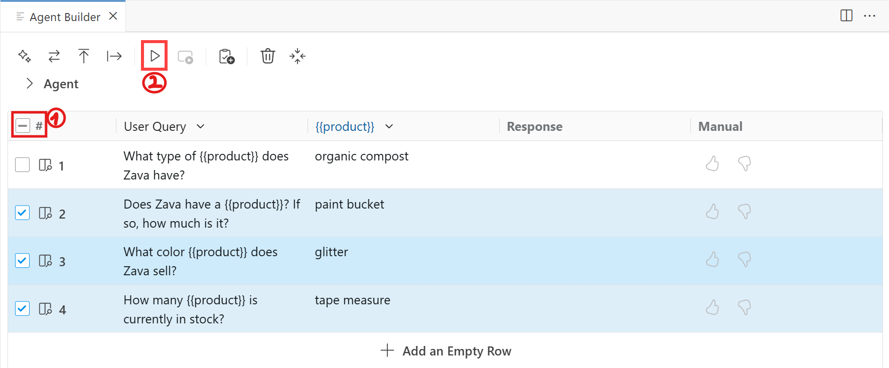

# Bonus: Manually Evaluate Your Agent Responses

> [!NOTE]
> This is a bonus section you can complete if you still have time during the allotted lab slot. Otherwise, you are more than welcome to go through it at your own pace once back home.

In this section, you will learn how to manually evaluate a dataset of your agent's responses. Manual evaluations are when humans directly judge the quality of an LLM’s output. In practice, this means a person reads the generated response and decides—often against a rubric or simple scale—whether it is correct, relevant, clear, or “good” versus “bad.” With Agent Builder, you can complete manual evaluations to assess your agent’s performance.

## Step 1: Add a Variable to the Agent Instructions

To use the Evaluation features of Agent Builder, the agent's **Instructions** must contain a variable. The variable itself is a value that can change the context of the agent instructions or user prompt, but is still relevant to the general purpose of the agent. Variables are surrounded by 2 sets of curly braces (ex: `{{variable}}`).

Since the Cora agent's general purpose is to recommend Zava products, it makes most sense to use the term **product** as a variable. What we can do is modify the **Instructions** to the following:

```
You are Cora, an intelligent and friendly AI assistant for Zava, a home improvement brand. You help customers with their DIY projects by understanding their needs and recommending the most suitable {{product}} from Zava’s catalog.​

Your role is to:​

- Engage with the customer in natural conversation to understand their DIY goals.​

- Ask thoughtful questions to gather relevant project details.​

- Be brief in your responses.​

- Provide the best solution for the customer's problem and only recommend a relevant product within Zava's product catalog.​

- Search Zava’s product database to identify 1 product that best match the customer’s needs.​

- Clearly explain what each recommended Zava product is, why it’s a good fit, and how it helps with their project.​
​
Your personality is:​

- Warm and welcoming, like a helpful store associate​

- Professional and knowledgeable, like a seasoned DIY expert​

- Curious and conversational—never assume, always clarify​

- Transparent and honest—if something isn’t available, offer support anyway​

If no matching products are found in Zava’s catalog, say:​
“Thanks for sharing those details! I’ve searched our catalog, but it looks like we don’t currently have a product that fits your exact needs. If you'd like, I can suggest some alternatives or help you adjust your project requirements to see if something similar might work.”​
```

All variables are stored in the **Variables** section in Agent Builder.


So how does this work? Suppose we want to use `eggshell paint` as the `{{product}}`. Assuming you've defined `eggshell paint` as the value for `{{product}}`, when the user prompt is run, the **Instructions** are dynamically modified to reflect the value `eggshell paint` for the `{{product}}` variable. Therefore, the agent instructions would read:

```
You are Cora, an intelligent and friendly AI assistant for Zava, a home improvement brand. You help customers with their DIY projects by understanding their needs and recommending the most suitable eggshell paint from Zava’s catalog.​
```

Let's see this in action by running a few lines of evaluation data!

## Step 2: Add Data

In Agent Builder, switch to the **Evaluation** tab. Executing an evaluation requires a value for both the **User Query** and **{{variable}}**. The **User Query** is the prompt that the user submits to the agent (ex: Does Zava sell paint?). The **{{variable}}** is the value for your variable (ex: `{{product}}`).

> [!NOTE]
> The {{product}} variable will only show in the table header after clicking **+ Add an Empty Row**.
>


You have a couple of options from here with respect to how you'd like to add data for your evaluation.

> [!TIP]
> To expand the **Evaluation** section, click the **Expand to Full Screen** icon next to the Trash Can icon.
>

**Manually Add Data**

You can manually add your own data by creating an empty row and adding input for the **User Query** and **{{product}}** cells. Provided below are some examples of **User Query** and **{{product}}** pairs:

|   User Query        | {{product}}
--------------|-------------
What type of {{product}} does Zava have?   | organic compost
Does Zava have a {{product}}? If so, how much is it?  | paint bucket
What color {{product}} does Zava sell?  | glitter
How many {{product}} is currently in stock?   | tape measure

**Generate Data**

If you need help with creating data, the **Generate Data** feature can generate up to 10 rows of synthetic data. Synthetic data is artificially created data that mimics real-world information, but isn’t collected from actual people or events. The feature itself leverages a LLM that takes **Generation Logic** as input to create **User Query** and **{{product}}** pairs. The **Generate Data** feature generates its own set of instructions (or Generation Logic) based on the agent's **Instructions**. However, you can modify the **Generation Logic** to your liking.


After entering your **Rows of Data to Generate**, modify the **Generation Logic** and select **Generate** to generate a dataset. The generated dataset appears in the evaluation table.

**Import a Dataset**

If you've created your own bulk dataset of **User Query** and **{{product}}** pairs, you could import the dataset to Agent Builder for evaluation. Agent Builder supports `.csv` files that are formatted in the following manner:

|   User Query        | {{product}}
--------------|-------------
What type of {{product}} does Zava have?   | organic compost
Does Zava have a {{product}}? If so, how much is it?  | paint bucket
What color {{product}} does Zava sell?  | glitter
How many {{product}} is currently in stock?   | tape measure

Whereas both **User Query** and **{{product}}** are headers. The **Import** icon (i.e. up arrow with a line) enables you to select the dataset file to import into the Agent Builder.


Consider experimenting with each option! The remaining instructions for this lab will continue to follow the first option: **Manually Add Data**

## Step 3: Assess Your Agent Output

With your dataset prepared, you can run rows one by one or select multiple rows to run together. To select a row, check the box to the left of the row. To run the row, select the **Run Response** icon (i.e. play button).



The model will generate a response for each **User Query** and **{{product}}** pair. Once the response is generated, review the output and select either the **thumbs up** or **thumbs down** icon in the **Manual** column.


How do you decide whether the response deserves a **thumbs up** or **thumbs down**? When deciding whether to give a thumbs up or thumbs down, think about whether the output met your expectations. A **thumbs up** means the response was accurate, relevant, clear, and genuinely helpful—it gave you the information or result you were looking for. A **thumbs down** means the response fell short in some way, such as being incorrect, incomplete, confusing, off-topic, or not useful for your task.

In short, ask yourself: **Did the output do what I needed it to? If yes, choose thumbs up; if not, choose thumbs down.**

## Key Takeaways

- Adding variables like {{product}} to agent instructions allows for systematic testing across different contexts while maintaining the agent's core purpose and functionality.
- Agent Builder supports manual data entry, synthetic data generation, and CSV imports, providing flexibility for creating evaluation datasets that match specific testing needs.
- Human judgment through thumbs up/down ratings helps assess whether agent responses meet expectations for accuracy, relevance, and usefulness beyond automated metrics.